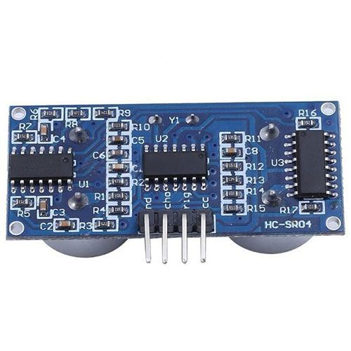

# Peilmeter met raspberry pi
## Beschrijving
Waterpeil in regenwaterput meten
Dagelijks het gemeten peil registreren in een bestand op het thuisnetwerk
Mail sturen bij vooraf ingesteld laag en hoog peil
## Bronnen

## Hardware
Raspberry Pi 4
Ultrasonic Ranging Module 4P - HC-SR04
## Software
## Eigen scripts en programma's
## Afbeeldingen

